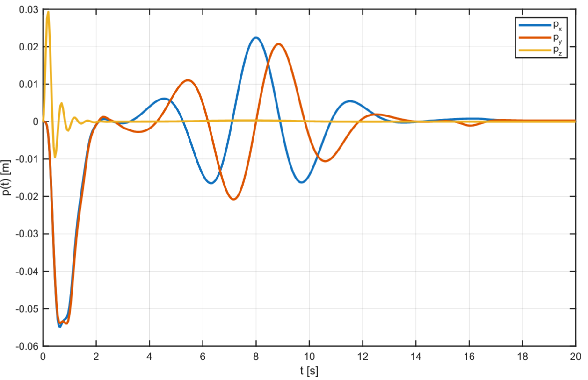
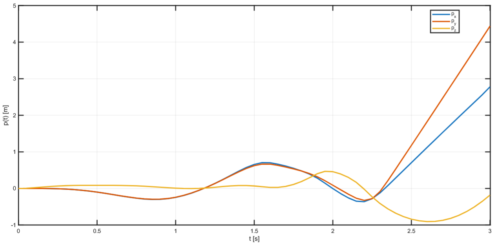
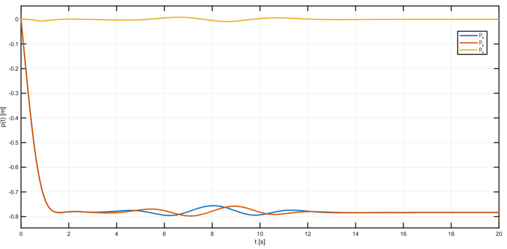
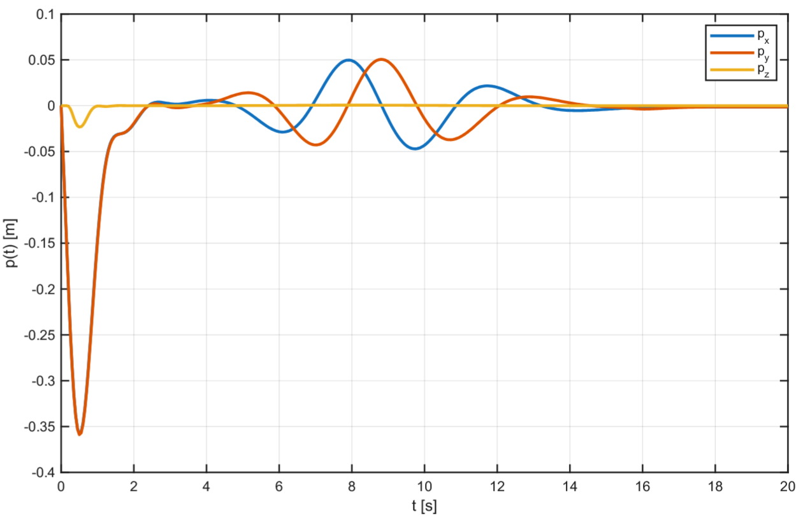

# UAV Trajectory Tracking: Adaptive NMPC vs. Observer-based MPC

This project presents a comparative study of two advanced control strategies for a quadrotor UAV: **Nonlinear Model Predictive Control (NMPC) with $\mathcal{L}_1$ Adaptation** and **Offset-Free NMPC with a Disturbance Observer**. 

---

### 📖 Technical Report
**The core of this research is detailed in the full technical report.** It contains the mathematical modeling, the controller design logic, and a deep dive into the simulation results.

👉 **[READ THE FULL REPORT (PDF)](docs/ICO_Report.pdf)** 👈

---

The goal was to evaluate their performance in trajectory tracking when facing different real-world challenges, such as unknown payloads and external environmental disturbances.

## 📌 Project Overview
Controlling UAVs is complex due to their non-linear dynamics and aerodynamic effects. While standard NMPC provides flexibility in handling constraints, it lacks inherent robustness to model uncertainties or persistent disturbances. This project implements and compares two solutions:

1.  **Adaptive NMPC ($\mathcal{L}_1$):** Adds a compensation term to the control input to counteract parametric uncertainties.
2.  **Observer-based NMPC:** Uses an estimator to identify constant additive disturbances and shifts the control target to compensate.

## 🚁 Demo

*3D Spiral Trajectory Tracking Simulation.*

## 🛠️ Technical Implementation
* **Platform:** MATLAB / Simulink.
* **Model:** 6-DOF Quadrotor modeled with unit quaternions for orientation to avoid singularities.
* **Solver:** Nonlinear MPC implemented using the `quadprog` optimizer.
* **Discretization:** 4th-order Runge-Kutta (RK4) method.
* **Trajectory:** A 3D spiral path followed by a hovering phase.

## 📊 Performance Comparison
The simulations reveal that there is no "absolute winner"; the ideal controller depends on the specific operating environment.

### 1. Robustness to Model Uncertainty
**Scenario:** The quadrotor mass is increased by **92%** (simulating an unknown payload).

| Adaptive NMPC ($\mathcal{L}_1$) | Observer-based NMPC |
| :---: | :---: |
|  |  |
| **Success**: Rejects parametric uncertainties. The error converges to zero after a short transient. | **Failure**: Cannot estimate model mismatches. The system becomes unstable and diverges. |

### 2. External Disturbance Rejection
**Scenario:** A constant force is applied to the x-y plane (simulating constant wind).

| Adaptive NMPC ($\mathcal{L}_1$) | Observer-based NMPC |
| :---: | :---: |
|  |  |
| **Poor**: Shows a constant steady-state error as it cannot "see" the additive force as a parameter change. | **Success**: Effectively estimates and rejects the offset, ensuring perfect tracking. |

## 🚀 Future Developments
A potential evolution of this work is merging both techniques to achieve simultaneous disturbance rejection and parameter robustness. However, two main limitations must be addressed:
* **Tuning Complexity:** Increasing degrees of freedom complicates the calibration procedure.
* **Computational Cost:** NMPC is demanding; a hybrid structure might lead to computation times incompatible with real-time hardware.

## 📂 Repository Structure
* `main.m`: Entry point to configure parameters and launch simulations.
* `models/`: Simulink models for both control strategies.
* `functions/`: Support scripts for trajectory planning and physics.
* `docs/`: Full technical report and high-resolution plots.
